# AEO Portal (A‑I‑DB) — GitHub Pages Frontend

A static, GitHub Pages–hosted portal that lets AEOs (Assistant Education
Officers) and School Education Department staff manage school data, staff
(HR) records, inspection allowance bills, and related admin tools for their
jurisdiction. The frontend is plain HTML/CSS/JS; data lives in
Supabase/Postgres (with Row‑Level Security enforcing jurisdiction scope) and
a Google Apps Script backend is still used for some legacy `google.script.run`
style calls via a shim.

---

## 1. What's actually in this repo

```
A-I-DB/
├── index.html                    ← Login + the entire app shell (all views live here)
├── config.js                     ← ⚠ WEB_APP_URL / Supabase config
├── school-status-gate.html       ← Standalone demo page
├── oauth-callback.html           ← Google OAuth redirect landing page
├── performance-certificate.html  ← Standalone AEO performance certificate generator
├── inspection-allowance-bill.html← Printable Inspection Allowance bill output
├── privacy.html / terms.html     ← Legal pages
│
├── css/
│   ├── styles.css                ← Core portal styles
│   ├── theme.css                 ← Theme tokens
│   └── portal-polish.css         ← Additive visual polish
│
└── js/
    ├── api.js                    ← fetch()/Supabase wrapper + google.script.run shim
    ├── index.js                  ← App shell: login, session, routing, dashboard
    ├── core.js                   ← Shared filter/table/export/modal engine
    ├── jurisdiction-lock.js      ← District→Wing→Tehsil→Markaz scope lock rules
    ├── public_schools.js         ← Govt/Public + Outsourced schools module
    ├── private_schools.js        ← Private + Inactive schools module
    ├── schools-import.js         ← Bulk school import
    ├── hr_view.js                ← Staff Statement (HR) module
    ├── staffform.js               ← Add/Edit/Transfer/Promotion/Separation modals
    ├── hr-staff-import.js        ← Bulk staff import
    ├── admin.js                  ← Admin Control Center (users, links, tools, KPI cards, lists)
    ├── user-import.js            ← Bulk user import (Admin)
    ├── inspection-allowance.js   ← Inspection Allowance bill preparation
    ├── budget-preparation.js / budget-pdf-assets.js  ← Budget prep & PDF export
    ├── dispatch-*.js             ← Dispatch/report letters, contacts, signature
    ├── expiry-alerts.js          ← Document/credential expiry alerts
    ├── performance.js            ← Performance certificate logic
    ├── profile.js                ← "My Profile" modal
    ├── login-feed.js / preloader.js / cache-service.js / perf-cache.js ← support utilities
```

> The folder structure previously documented here (separate `app.html`,
> `landing.js`, etc.) is out of date — everything now lives in a single
> `index.html` app shell.

---

## 2. Full application flow (Mermaid)

```mermaid
flowchart TD
    Start([User opens index.html]) --> Restore{Saved session<br/>in localStorage?}

    Restore -- No --> LoginView[Show Login View<br/>CNIC + Password]
    Restore -- Yes --> Verify{Supabase session<br/>still valid?}
    Verify -- No --> LoginView
    Verify -- Yes --> EnterApp

    LoginView --> DoLogin[Call doLogin]
    DoLogin --> Backend[/Backend: login with cnic and password/]
    Backend --> LoginOK{Success?}
    LoginOK -- No --> ToastErr[Show error toast]
    ToastErr --> LoginView
    LoginOK -- Yes --> SaveSession[Save session to localStorage]
    SaveSession --> EnterApp[Call enterApp for the user]

    EnterApp --> SetJur[Save jurisdiction: role + district/wing/tehsil/markaz]
    SetJur --> AdminBtn{role == admin?}
    AdminBtn -- Yes --> ShowAdminBtn[Show 'Admin Panel' nav button]
    AdminBtn -- No --> HideAdminBtn[Admin Panel hidden]
    ShowAdminBtn --> Dashboard
    HideAdminBtn --> Dashboard[Home Dashboard]

    Dashboard --> Cards{Pick a module card}

    %% ---------------- MODULE CARDS ----------------
    Cards --> SchoolMgmt[School General Data Management]
    Cards --> HR[Staff Statement]
    Cards --> Tools[Portal Tools]
    Cards --> Performas[Official Performas<br/>opens external site]
    Cards --> IA[Inspection Allowance]
    Cards --> Profile[My Profile]
    Cards --> AdminPanel[Admin Panel]

    %% ---------------- JURISDICTION LOCK (shared) ----------------
    SchoolMgmt --> JurLock{{Jurisdiction Lock:<br/>base / markaz / tehsil / wing / district / admin}}
    HR --> JurLock
    JurLock --> JurLockEffect[Locks/greys District‑Wing‑Tehsil‑Markaz dropdowns<br/>to the user's assigned scope.<br/>Row visibility is enforced server‑side<br/>by Postgres RLS on the schools/staff tables.]

    %% ---------------- SCHOOL DATA ----------------
    SchoolMgmt --> PubPriv{Public or Private?}
    PubPriv --> Public[Govt / Public Schools<br/>Active & Outsourced views]
    PubPriv --> Private[Private Schools<br/>Active & Inactive views]

    Public --> PubActions[Filter · Export · Edit row<br/>within own jurisdiction]
    Public --> PubImport[Bulk Import]
    Public -.-> PubAddHidden[[Add School button is hidden for everyone]]

    Private --> PrivActions[Filter · Export · Edit row<br/>within own jurisdiction]
    Private --> PrivImport[Bulk Import]
    Private -.-> PrivAddRule[[Add School available on Active view,<br/>hidden on Inactive view]]

    %% ---------------- HR / STAFF ----------------
    HR --> HrSheets[Sidebar: Staff · Retirement · Resignation ·<br/>Deceased · Termination ·<br/>Transfer/Promotion History · Deleted Archive]
    HrSheets --> HrRow{Click a staff row}
    HrRow --> HrView[View Details — everyone]
    HrRow --> HrEdit[Edit Record — everyone]
    HrRow --> HrTransfer[Transfer / Mutual Transfer — everyone<br/>search ANY EMIS, not jurisdiction‑limited]
    HrRow --> HrPromo[Promotion — everyone<br/>search ANY EMIS]
    HrRow --> HrSep[Retirement / Resignation /<br/>Termination / Death — everyone]
    HrRow --> HrAdd[Add Staff / Bulk Import — everyone]
    HrRow --> HrAdminOnly{{role == admin?}}
    HrAdminOnly -- Yes --> HrDelete[Delete Record /<br/>Undo Transfer / Undo Promotion]
    HrAdminOnly -- No --> HrBlocked[Not shown]

    %% ---------------- INSPECTION ALLOWANCE ----------------
    IA --> IAMode{Tehsil budget type?}
    IAMode --> IACollective[Collective:<br/>Tehsil Representative prepared deductions.<br/>AEO just picks prepared month or months<br/>read‑only deduction]
    IAMode --> IAIndividual[Individual:<br/>AEO picks 1‑4 months, any year,<br/>enters own deduction, or leaves blank<br/>for full rate]
    IACollective --> IABill[Generate Bill]
    IAIndividual --> IABill
    IABill --> IAHistory[Read‑only 18‑month history, view only]

    %% ---------------- TOOLS / PERFORMAS ----------------
    Tools --> ToolsList[Launch admin‑curated<br/>external tool links, opens new tab]

    %% ---------------- PROFILE ----------------
    Profile --> ProfileEdit[View/edit own contact details<br/>everyone, own record only]

    %% ---------------- ADMIN PANEL (admin only) ----------------
    AdminPanel --> AdminGate{{role == admin?<br/>enforced client‑side + RLS}}
    AdminGate -- No --> AdminDenied[Nav button not shown /<br/>no access]
    AdminGate -- Yes --> AdminTabs

    subgraph AdminTabs [Admin Control Center — Admin only]
        direction TB
        AU[User Management<br/>create/edit users: role, CNIC/password,<br/>district/wing/tehsil/markaz,<br/>scope type & value, access type]
        AL[Links & Apps Manager<br/>manage quick‑link & app directory shown to users]
        AT[Tools Manager<br/>manage the links shown under 'Portal Tools']
        AK[Dashboard Cards Manager<br/>add/hide module cards on the home dashboard,<br/>set display order]
        AG[General Management<br/>Staff Designations list ·<br/>Private School Categories list,<br/>feeds every dropdown portal‑wide]
        AI[Inspection Allowance Management<br/>configure rates / Tehsil Representative assignment]
    end

    %% ---------------- LOGOUT ----------------
    Dashboard --> Logout[Logout]
    Logout --> ClearSession[Clear session + jurisdiction cache]
    ClearSession --> LoginView

    classDef adminOnly fill:#fde2e2,stroke:#b91c1c,color:#7f1d1d;
    classDef everyone fill:#e0f2fe,stroke:#0369a1,color:#0c4a6e;
    classDef system fill:#f1f5f9,stroke:#64748b,color:#334155;

    class AdminPanel,AdminTabs,AU,AL,AT,AK,AG,AI,HrDelete,ShowAdminBtn adminOnly;
    class Public,Private,HR,IA,Tools,Performas,Profile,PubActions,PrivActions,HrView,HrEdit,HrTransfer,HrPromo,HrSep,HrAdd everyone;
    class Backend,JurLock,Verify,Restore system;
```



---

## 3. Who can do what — permission summary

| Area | Every logged‑in user | Admin only |
|---|---|---|
| **Login / session** | Log in with CNIC + password, session persists across tabs | — |
| **Dashboard** | See all module cards, KPI counts for their own jurisdiction | Sees "Admin Panel" nav button |
| **Public / Govt Schools** | Filter, export, edit rows, bulk‑import — restricted to their jurisdiction | Full portal‑wide access (jurisdiction lock lifted) |
| **Private Schools** | Same as above; "Add School" hidden only on the Inactive view | Same, unrestricted |
| **Staff Statement (HR)** | View, edit, transfer, mutual transfer, promote, and process retirement/resignation/termination/death for staff; add & bulk‑import staff; transfer/promotion searches **any** school system‑wide | Also: delete a staff record, undo a transfer, undo a promotion |
| **Inspection Allowance** | Prepare and generate their own bill (Collective or Individual mode); view read‑only history | Configure rates & Tehsil Representative assignments (Admin panel) |
| **Portal Tools / Official Performas** | Launch whatever links the admin has published | Manage which links/tools are published |
| **My Profile** | View/edit their own contact info | — |
| **Admin Control Center** | No access — nav item is hidden and the view isn't reachable | User Management, Links & Apps Manager, Tools Manager, Dashboard Cards Manager, General Management (designations & school categories), Inspection Allowance Management |

**Jurisdiction scope** (applies to Schools & HR modules) is one of, from
narrowest to widest: `base` (single Markaz) → `markaz` (extra Markazes) →
`tehsil` → `wing` → `district` → `admin` (unrestricted). An assigned scope
locks/greys the District/Wing/Tehsil/Markaz filter dropdowns accordingly;
actual row‑level restriction is enforced server‑side by Postgres Row‑Level
Security, not just the UI.

---

## 4. Setup

1. **Backend** — Supabase project with the `app_users` / schools / staff
   tables and RLS policies in place (see jurisdiction‑lock rules above);
   legacy calls still route through a Google Apps Script Web App via the
   `google.script.run` shim in `js/api.js`.
2. **Configure** — open `config.js` and set your Supabase URL/key and/or
   `WEB_APP_URL` for the Apps Script endpoint.
3. **Deploy** — push to GitHub, enable **Settings → Pages** (source:
   `main` branch, `/ (root)`). The portal is then live at
   `https://YOUR_USERNAME.github.io/REPO_NAME/`.
